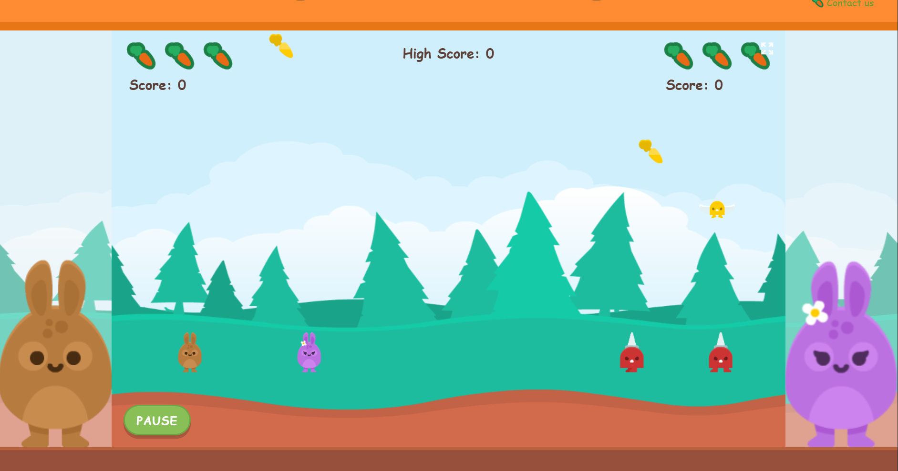

# 🥕 Happy Bunnies 🥕

**Happy Bunnies** A responsive 2D browser survival game built with vanilla JavaScript.

## 🐰 Live Demo
> **Play the game here: [Hop into the adventure!](https://deeumiya-huang.github.io/happy-bunnies-game/)**

---

## 🎮 How To Play

### Game Rules
1. **Choose Mode**: Choose the mode you want to play - `Single/Dual`.
2. **Collect Carrots**: Each carrot earned adds 1 point to your score.
3. **Avoid Enemies**: Colliding with ground or sky enemies results in losing 1 life.
4. **Survival**: Each player starts with 3 lives (represented by carrots). In dual mode, the game ends when both players run out of lives.
5. **High Scores**: Your personal best is saved locally using `localStorage`.

### Keyboard Configuration
| Action | Player 1 (Bunny 1) | Player 2 (Bunny 2) | Mobile Controls |
| :--- | :--- | :--- | :--- |
| **Move Left** | `A` | `←` | Left Arrow Icon |
| **Move Right** | `D` | `→` | Right Arrow Icon |
| **Jump** | `W` | `↑` | Up Arrow Icon |
| **Pause** | `P` | - | Pause Button |
| **Start/Restart**| `Enter` | - | Start Button |

---

## 🛠️ Tech Used
* **Language**: JavaScript
* **Rendering**: HTML5 Canvas API
* **Styling**: CSS3
* **Development**: JetBrains IntelliJ IDEA / WebStorm

---

## ✨ Features
* **Dual-Mode Gameplay**: Support for both solo challenges and local competitive play.
* **Responsive Design**: Support for both computer and mobile players, featuring a custom mobile UI with SVG arrow icons for mobile controls.
* **Game Physics**: Implement collision detection, gravity constants, and "hang-time" jumping mechanics for a smooth feel.
* **Difficulty**: A level-up system that change enemy and item speeds as a new round begin.
* **Efficient Rendering**: Utilizes Sprite Sheet animations and layered background rendering to improve efficiency.

---

## 🧠 Technical Key Learnings

Building this game from scratch let me learn a lot from it. Here are the core things I gained:

### 1. Performance: Canvas vs. DOM
Initially, I considered using DOM elements for game objects, but I quickly pivoted to the **HTML5 Canvas API**. This shift allowed for direct pixel rendering, which is far more efficient for games with many moving parts, ensuring a consistent 60FPS experience.

### 2. The Power of Modular Architecture
I started with a monolithic script where everything was interconnected. As the feature list grew, the code became unmanageable.
- **The Solution**: Refactor the project into a **Modular Design** (decoupling `Main`, `Game`, and `EntityManager`).

### 3. Memory Optimization via Object Pooling
To avoid the lag caused by frequent **Garbage Collection (GC)**, I implemented an **Object Pool** for enemies and items. Instead of constantly instantiating and destroying objects, the game recycles them, which significantly reduced memory overhead.

### 4. Logic Sequence & Collision Detection
A critical bug I met is that where the loop execution order caused a single collision to be detected multiple times, draining both players' health at once. I learned to manage **collision flags** and precise loop sequencing to ensure game logic remains fair and accurate.

### 5. Managing Asynchronous Asset Loading
Use **Async/Await** and **Promises** to ensure all sprite sheets and backgrounds are fully loaded before the first frame is rendered, preventing null-reference errors and visual flickering.

### 6. Dynamic Scaling in Responsive Design
Hardcoding values in a **Constructor** makes them "stale" when the window is resized. I transitioned to using **dynamic getters** and recalculation methods, ensuring that entities always spawn and move correctly relative to the current viewport and "Ground Level."

### 7. Resource Efficiency with Sprite Sheets
To optimize network requests, using **Sprite Sheets** can reduce the number of HTTP requests and taught me how to handle frame-based coordinate clipping to animate characters efficiently on the Canvas.

---

## 📂 Project Structure
The project follows a modular structure for better maintainability:
- `Main.js`: Manages web-specific logic
- `Game.js`: **Core Game Engine** Handles the main **Game Loop** (Update/Render cycles), manages internal game states, and coordinates communication between all functional modules.
- `EntityManager.js`: Handles collision detection and spawning logic.
- `AssetLoader.js`: Ensures all assets are ready before the game starts.
- `Config.js`: Centralized game constants and dynamic ground scaling.

---

## 🚀 Future Enhancements
- **Audio**: Add BGM and sound effects(jump, collect, hit).
- **Mobile UX**: Improve virtual joystick layout and adjust game configuration details. 
- **Difficulty**: Implement more enemy patterns (different movement).
- **Backend**: Replace LocalStorage with a REST API for global leaderboards.
---
**Author**: Deeumiya Huang | Waikato IT Student